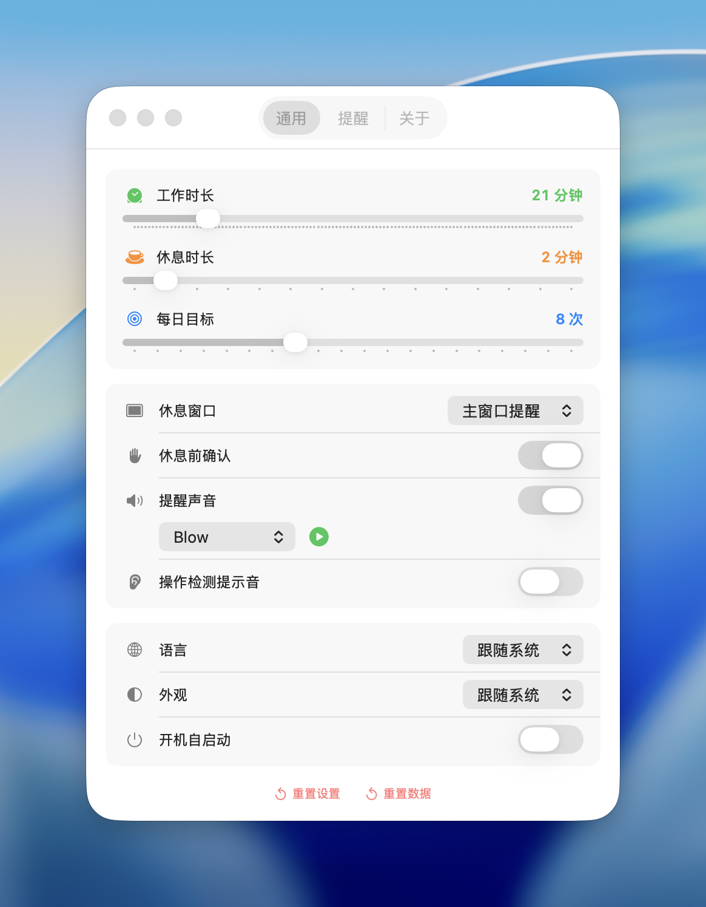

  

<h1 align="center">HealthTick 健康打卡</h1>

  <strong>macOS 菜单栏久坐提醒工具</strong> 
  久坐提醒 · 强制休息 · 习惯养成

  
  
  

  <a href="https://github.com/lifedever/health-tick-release/releases/latest">
    ⬇️ <strong>点击下载最新版本</strong>
  </a>

---

## ✨ 功能特色

| 功能 | 说明 |
|------|------|
| 🕐 **智能计时** | 自定义工作时长（1-120 分钟）和休息时长（1-15 分钟） |
| 💪 **强制休息** | 休息时弹窗提醒，支持右上角 / 左上角 / 屏幕中央 / 全屏强制 |
| 🔍 **操作检测** | 休息期间检测到键鼠操作自动暂停倒计时，确保真正休息 |
| 🎯 **每日目标** | 设定每天休息次数目标，追踪完成进度 |
| 🔥 **连续打卡** | 记录连续达标天数，激励持续坚持 |
| 🏆 **徽章系统** | 11 枚隐藏徽章等你解锁，从「迈出第一步」到「年度传说」 |
| 📊 **数据统计** | 7 天柱状图、30 天热力图、周/月达标率一目了然 |
| 📌 **菜单栏常驻** | 轻量运行，不打扰工作 |
| 🔄 **自动更新** | 启动时自动检查新版本，也可手动检查 |

## 📥 安装

前往 [Releases](https://github.com/lifedever/health-tick-release/releases/latest) 页面下载最新版本：

1. 下载 **`.dmg`** 文件，打开后将 HealthTick 拖入 Applications 文件夹
2. 或下载 **`.zip`** 文件，解压后移动到"应用程序"文件夹

> 💡 首次打开可能提示"无法验证开发者"，请前往 **系统设置 → 隐私与安全性** 点击"仍要打开"。

## 🔄 更新

- 应用启动时会自动检查新版本并提示下载
- 也可在 **设置 → 关于** 中手动检查更新

## 💻 系统要求

- macOS 14 (Sonoma) 或更高版本
- Apple Silicon / Intel 均支持

## 📸 截图

<table><tr><td></td><td></td></tr></table>

---

## ☕ 赞助支持

HealthTick 完全免费使用。如果它对你的健康有帮助，欢迎赞助支持开发者继续维护和改进！

  &nbsp;&nbsp;&nbsp;&nbsp;&nbsp;
  

  <strong>感谢每一位支持者 ❤️</strong>

---

## 💬 反馈

遇到问题或有建议？欢迎在 [Issues](https://github.com/lifedever/health-tick-release/issues) 中反馈。

  Made with ❤️ for your health

